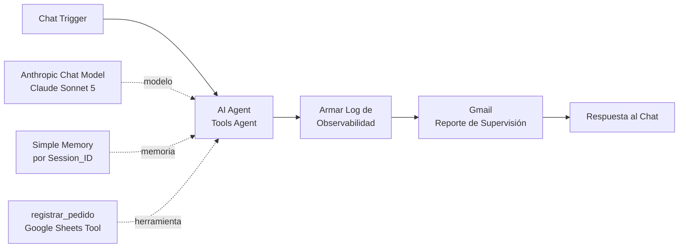

# 🤖 Proyecto Integrador · AI Automation Avanzado (Coderhouse)

**Autora del proyecto:** Joselin Pereira
**Hito actual:** Checkpoint 1 · Agente base y motor de razonamiento (M1)
**Archivo de entrega:** [`checkpoint1_joselin_pereira.json`](./checkpoint1_joselin_pereira.json)

---

## 📌 El caso: Aqua, asistente de pedidos de AquaNorte

AquaNorte es una empresa de reparto a domicilio de agua purificada en bidones y alquiler de dispensers. Hoy los pedidos llegan por mensaje en forma desordenada: faltan datos, se pierden reclamos y el equipo de logística tiene que reconstruir cada pedido a mano.

**Aqua** es un agente autónomo que atiende a los clientes por chat, completa los datos del pedido, pide confirmación y lo registra en una planilla. Cuando un caso requiere intervención humana (reclamos, facturación, pedidos corporativos), lo deriva a un operador. Cada conversación genera un reporte de supervisión por correo.

---

## 🧠 Arquitectura del flujo (n8n)

| Componente | Configuración |
|---|---|
| **Disparador** | Chat Trigger: captura el mensaje desestructurado del cliente |
| **Motor de razonamiento** | AI Agent en modo **Tools Agent** (ciclo ReAct) |
| **Modelo** | Anthropic Chat Model · Claude Sonnet 5 · temperatura 0.2 |
| **Guardrail** | Máximo **7 iteraciones** para evitar bucles infinitos y proteger el presupuesto |
| **Memoria** | Simple Memory con ventana de 10 interacciones por sesión |
| **Herramienta** | `registrar_pedido`: agrega filas en Google Sheets, conectada lateralmente al agente |
| **Observabilidad** | Nodo Code que arma el Execution Log + envío por Gmail en cada conversación |

---

## 📜 System Prompt (estructura modular)

El prompt del agente está organizado en bloques:

1. **Rol:** asistente de toma de pedidos de AquaNorte, trato cordial y profesional.
2. **Ámbito:** productos, zonas de reparto, pedidos nuevos y derivaciones. Todo lo demás queda fuera.
3. **Objetivo:** convertir cada conversación en un pedido completo con 5 datos obligatorios (nombre, teléfono, dirección, producto y cantidad, franja horaria).
4. **Procedimiento:** detectar intención → pedir datos faltantes → resumir → pedir confirmación → registrar una sola vez.
5. **Reglas y restricciones:** no inventar precios, stock ni plazos; no registrar sin confirmación; no pedir datos de pago ni documentos; no modificar pedidos existentes; no responder temas ajenos.
6. **Escalamiento:** reclamos, facturación, pedidos de más de 10 bidones, cancelaciones o clientes molestos se registran con estado *Requiere operador*.

## 🛠️ Herramienta y descripción semántica

La herramienta `registrar_pedido` tiene una descripción extensa que le indica al modelo **cuándo usarla** (pedido confirmado o derivación a operador) y **cuándo no** (consultas informativas, datos incompletos, falta de confirmación, pedidos duplicados). Los valores de cada columna los completa el propio agente mediante `$fromAI()`.

Estructura de la planilla:

`Fecha | Session_ID | Nombre | Telefono | Direccion | Producto | Cantidad | Franja_Horaria | Estado | Observaciones`

---

## ✅ Validación (pruebas realizadas)

| # | Escenario | Mensaje de prueba | Resultado |
|---|---|---|---|
| 1 | Pedido completo | "Quiero 2 bidones de 20 litros, soy Juan Pérez…" + "confirmo" | El agente resume, espera confirmación y registra la fila con Estado **Nuevo** |
| 2 | Escalamiento | "Me llegó un bidón roto, soy Ana Gómez, 11 4444-9876" | Registra la fila con Estado **Requiere operador** y el motivo en Observaciones, sin prometer soluciones |
| 3 | Fuera de ámbito | "¿Me pasás una receta de pizza?" + insistencia | Rechaza y redirige a pedidos. **No invoca la herramienta** |

En los tres casos el recorrido del flujo terminó en verde y se recibió el reporte de observabilidad por correo, con el detalle de las herramientas invocadas.

---

## ▶️ Cómo importar y probar

1. En n8n: **Import from File** → `checkpoint1_joselin_pereira.json`.
2. Cargar credenciales en: Anthropic Chat Model, `registrar_pedido` (Google Sheets OAuth2) y Gmail (Gmail OAuth2).
3. Crear una Google Sheet con una pestaña **Pedidos** y los encabezados indicados arriba, y seleccionarla en `registrar_pedido`.
4. Indicar el correo de destino en el nodo Gmail.
5. Abrir **Open chat** y probar los escenarios de la tabla de validación.

> El archivo exportado no contiene API keys ni tokens: las credenciales se configuran en cada instancia de n8n.

---

## 🗺️ Hoja de ruta

| Módulo | Evolución del agente | Estado |
|---|---|---|
| M1 | Agente base: Trigger + AI Agent + System Prompt + Tool + Observabilidad | ✅ Entregado |
| M2 | Arquitectura multi-agente: Manager + Workers como sub-workflows | ⏳ |
| M3 | Memoria persistente en Airtable por Session_ID | ⏳ |
| M4 | Integraciones reales: CRM, Calendario y Workspace vía OAuth2 | ⏳ |
| M5 | RAG: base documental y vector store (LlamaCloud) | ⏳ |
| M6 | Voz: STT / TTS | ⏳ |
| M11 | Proyecto Final Integrador | ⏳ |
